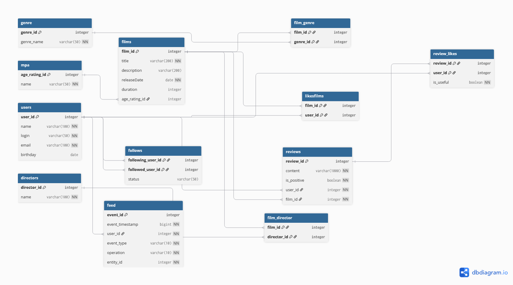

# java-filmorate
Template repository for Filmorate project.

# Команда и распределение задач

## Участники и зоны ответственности

| Участник | GitHub | Задачи |
| :--- | :--- | :--- |
| **Яшар Исмаилов** | [yromancov](https://github.com) | <ul><li>Подготовка проекта и схемы БД (`fix schema`)</li><li>Режиссёры (`add director`)</li><li>Поиск (`add search`)</li><li>Популярные фильмы с фильтрами (`add most populars`)</li><li>Ревью PR</li></ul> |
| **Анна Патрушева** | [annkefri](https://github.com) | <ul><li>Удаление фильмов и пользователей (`add remove endpoint`)</li><li>Общие фильмы (`add common films`)</li><li>Рекомендации (`add recommendations`)</li></ul> |
| **Дмитрий Хмелев** | [Hardcoreshhick](https://github.com) | <ul><li>Отзывы (`add reviews`)</li><li>Лента событий (`add feed`)</li></ul> |

## Процесс разработки

* **Ветвление:** От ветки `main` была создана ветка `develop`. Каждая отдельная задача велась в своей собственной ветке, созданной от `develop`, с названием строго по ТЗ.
* **Интеграция кода:** Все изменения вливались обратно в `develop` через Pull Request (PR) только после прохождения код-ревью от других участников команды.
* **Работа с базой данных:** Чтобы избежать конфликтов в файле `schema.sql`, схема БД была подготовлена заранее одним участником проекта.

# Схема базы данных приложения Movies

## Диаграмма сущностей (ER-диаграмма)

 

## Пояснение к схеме

База данных спроектирована согласно правилам 1НФ, 2НФ и 3НФ. 
- Отношения «многие ко многим» (Фильмы-Жанры, Друзья, Лайки к фильмам) вынесены в отдельные промежуточные таблицы.
- В таблицах связи используются составные первичные ключи `(PK)` для предотвращения дублирования данных.

---

## Примеры SQL-запросов для основных операций

### 1. Получение всех фильмов с их жанрами
Запрос объединяет таблицы через `LEFT JOIN`, чтобы отобразить фильмы, даже если у них временно нет жанра.
```sql
SELECT 
    f.film_id, 
    f.title, 
    f.description,
    f.releaseDate,
    f.duration,
    STRING_AGG(g.genre_name, ', ') AS genres
FROM films f
LEFT JOIN film_genre fg ON f.film_id = fg.film_id
LEFT JOIN genre g ON fg.genre_id = g.genre_id
GROUP BY f.film_id, f.title, f.description, f.releaseDate, f.duration;
```

### 2. Получение списка всех пользователей
```sql
SELECT user_id, name, login, email, birthday 
FROM users;
```

### 3. Топ N наиболее популярных фильмов
Запрос подсчитывает количество лайков для каждого фильма, сортирует их по убыванию и выводит самые популярные.
```sql
SELECT 
    f.film_id, 
    f.title, 
    COUNT(ml.user_id) AS likes_count
FROM films f
LEFT JOIN likesfilms ml ON f.film_id = ml.film_id
GROUP BY f.film_id, f.title
ORDER BY likes_count DESC, f.title ASC
LIMIT 10; -- Вместо 10 можно подставить любое число N
```

### 4. Список общих друзей с другим пользователем
Запрос находит пересечение (INTERSECT) списков подписок для Пользователя №1 и Пользователя №2.
```sql
-- Подписки первого пользователя
SELECT u.user_id, u.name 
FROM users u
JOIN follows f ON u.user_id = f.followed_user_id 
WHERE f.following_user_id = 1

INTERSECT

-- Подписки второго пользователя
SELECT u.user_id, u.name 
FROM users u
JOIN follows f ON u.user_id = f.followed_user_id 
WHERE f.following_user_id = 2;
```
